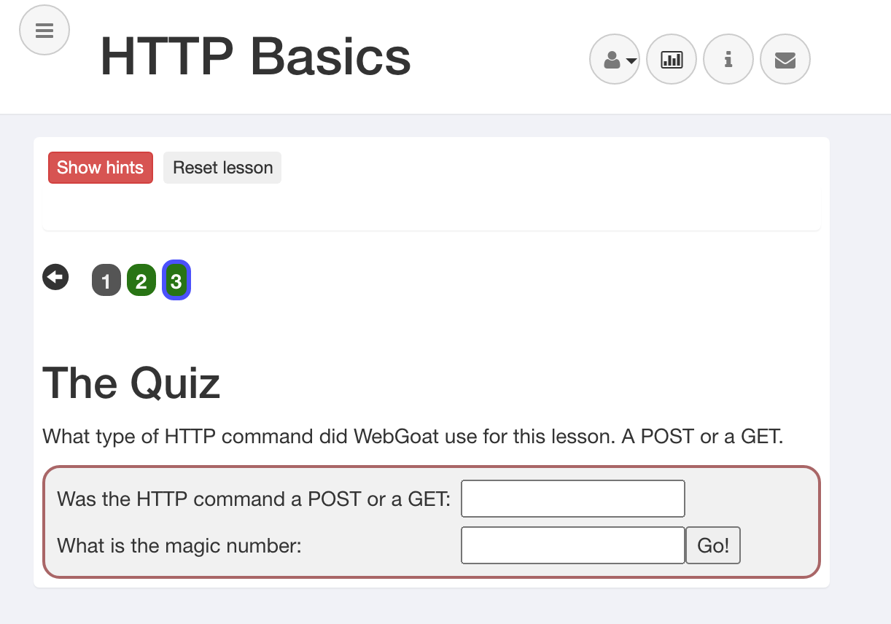
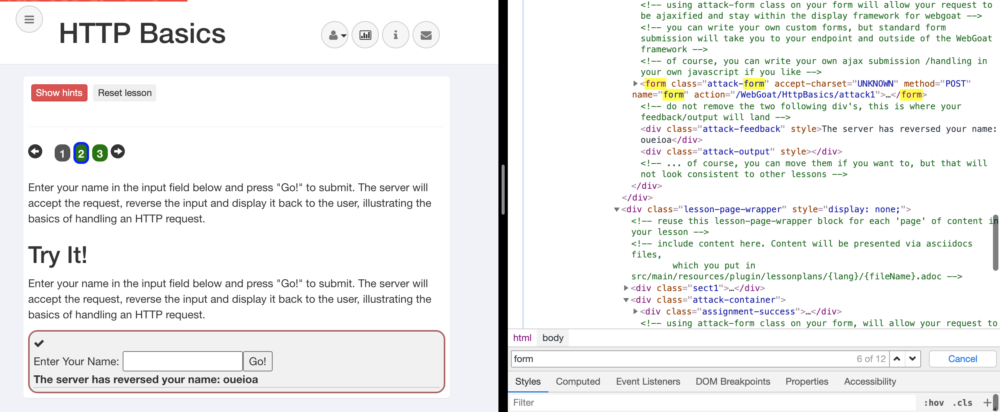
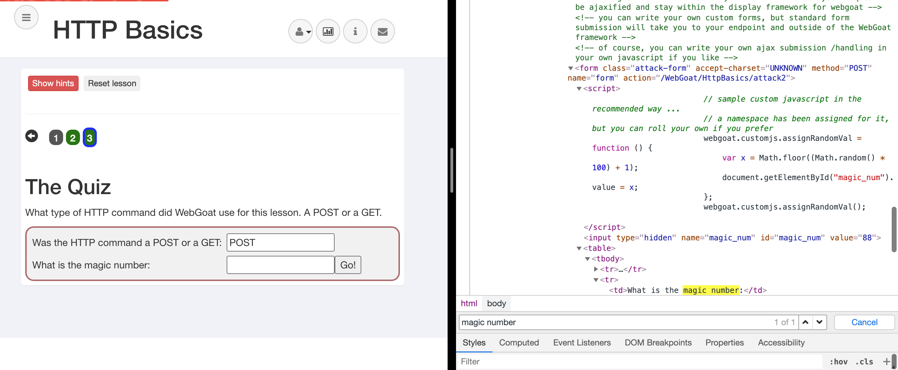

# HTTP Basics

## Concept

This lesson presents the basics for understanding the transfer of data between the browser and the web application and how to trap a rwquest/response with a HTTP proxy.

## Goals

The user shoueld become familiar with the features of WebGoat by manipulating the above buttons to view hints, show the HTTP request parameters, the HTTP request cookies, and the Java source code.

## How HTTP works:

All HTTP transactions follow the same general format. Each client request and server response has three parts: the request or response line, a header section and the entity body.

The client initiates a transaction as follows:

- The client contacts the server and sends a document request. A GET request can have url parameters and those parameters will be available in the web access logs.
  - GET /index.html?param=value HTTP/1.0
- Next, the client sends optional header information to inform the server of its configuration and the document formats it will accept.
- In a POST request, the user supplied data will follow the optional headers and is not part of the contained within the POST URL.

## The Quiz

What type of HTTP command did WebGoat use for this lesson. A POST or a GET.

1. Let's go back and check the source code of Form.
2. Search for 'form' within html source code. Then, we can find whether a method of the form is GET or POST: ⍤⃝, **the answer is 'POST'!**

3. Come back to the quiz page. According to the second requirement, we have to find the `magic number`.

   Let's search 'magic number' within source code.

4. \>_< We found all answers! **Magic number is 88.** Magic number was also hidden in html source.

끄 읏