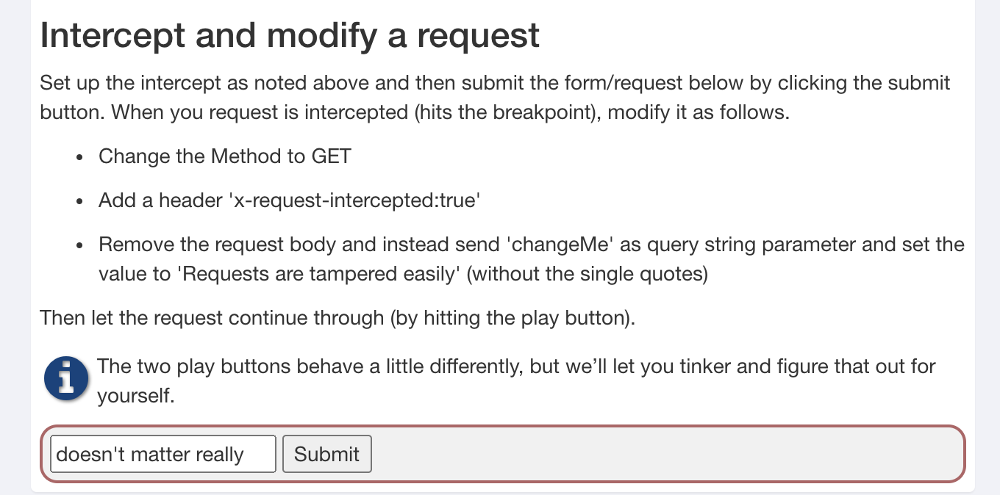

# HTTP Proxies

## What's a HTTP Proxy

A proxy is some forwarder application that connects your http client to backend resources. HTTP clients can be browsers, or applications like curl, SOAP UI, Postman, etc. Usually these proxies are used for routing and getting access to internet when there is no direct connection to internet from the client itself. HTTP proxies are therefore also ideal when you are testing your application. You can always use the proxy log records to see what was actually sent from client to server. So you can check the request and response headers and the XML, JSON or other payload.

HTTP Proxies receive requests from a client and relay them. They also typically record them. They act as a man-in-the-middle. It even works fine with or without HTTPS as long as your client or browser trusts the certificate of the HTTP Proxy.

~~영어는 힘들다....... 한국인은 한국어를!~~

프록시 문제풀쟈!

문제에서 시키는 대로 해볼까요~

- Change the Method to GET
- Add a header 'x-request-intercepted:true'
- Remove the request body and instead send 'changeMe' as query string parameter and set the value to 'Requests are tampered easily' (without the single quores)

자 그럼 일단 요청/응답을 인터셉트하기 위해 BurpSuite를 써야합니다.

저는 BurpSuite 에서 제공하는 Chromium 브라우저로 열었습니다.

저 페이지에 들어간다음에 `Intercept is on` 을 합니다. 그 다음에 POST 요청을 보내요 (Submit 버튼)

그 다음에 BurpSuite 로 다시 돌아와서 `Drop` 을 눌러주면 POST request가 나옵니다!!

쨘

이제 문제에서 시키는 대로 request를 변경해줘야 합니다.

1. POST를 GET으로
2. 'x-request-intercepted: true' 헤더 추가하기
3. request Body는 삭제하라고 했으니가 밑에 있는 changeMe=어쩌구를 지우고 요청 url뒤에 쿼리 스트링으로 붙여준다. `?changeMe=Requests+are+tempered+easily` 요렇게!

밑에 사진처럼 바꿔주면 된다 >\_\_\_\_< 

그 다음에 Repeat 탭에 들어가서 우리가 수정한 내용으로 Request를 다시 보낸다.

그러면 Response가 돌아오고, 사이트에서는 문제가 풀린 것으로 처리되어 있는 것을 볼 수 있다^_^

끄 읏!