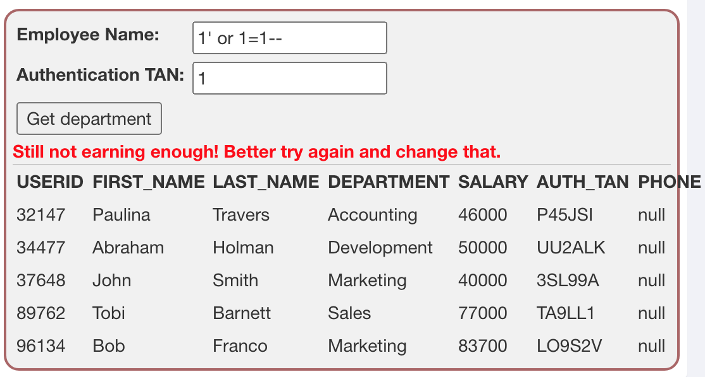

# SQL Injection (intro 9-13)

## 9. Try It! String SQL injection

The query in the code builds a dynamic query as seen in the previous example. The query is build by concatenating strings making it susceptible to string SQL injection:

```
"SELECT * FROM user_data WHERE first_name = 'John' AND last_name = '" + lastName + "'";
```

Using the form below **try to retrieve all the users** from the users table. You shoud not need to know any specific user name to get the complete list.

------

자아 우리는 여기서 마지막에 쿼리스트링을 채웁니다

마지막에 보면 `last_name="` 하고 따옴표가 오기 때문에! 우리는 string injection을 해줘야 해요^^

자 쉬워요 쉬워요~ 우리는 `or` 구문을 이용해서 우회할 것입니다.

저 뒤에 아무거나 써줘도 돼요. 왜냐면  false가 돼도 상관이 없거든요.

그래서 이렇게 입력해주면 돼요

```sql
'가용' or '1'='1
```

이렇게 넣으면 `lastName` 에 우리가 입력한 값이 들어가기 때문에 

```sql
SELECT * FROM user_data WHERE first_name = 'John' AND last_name = '가용' or '1'='1'
```

이 쿼리가 실행됩니다. 아직도 모르시겠다면>< 대답해드리는 게 인지상정!

지금 완성된 쿼리문을 보면 WHERE 절이

`false AND false or true` 의 형태를 띠고 있죠? 이 때, 연산 순서는 and가 먼저이므로 and 실행 후 `false or true`가 되고, 이는 무조건 `true`가 되어요.

이 문제처럼 적절한 상황에서  `or [true가 되는 문장]` 의 형태로 마지막에 넣어주면 우회할 수 있어용 아주 쉽죠?

------

## 10. Try It! Numeric SQL injection

The query in the code builds a dynamic query as seen in the previous example. The query in the code builds a dynamic query by concatenating a number making it susceptible to Numeric SQL injection:

```
"SELECT * FROM user_data WHERE login_count = " + Login_Count + " AND userid = " + User_ID;
```

Using the two Input Fields below, try to retrieve all the data from the users table.

Warning: Only one of these fields is susceptible to SQL Injection. You need to find out which, to successfully retrieve all the data.

------

얘도 마찬가지로 맨 뒤에서 `or [true가 되는 문장] ` 을 추가해주면 끝입니다.


이런 식으로 하면 끝납니다요.

------

## Compromising confidentiality with String SQL infection

If a system is vulnerable to SQL infections, aspects of that system's CIA triad can be easily compromised. In the following three lessons you will learn how to compromise each aspect of the CIA triad using techniques like *SQL string injections* or *query chaining*.

In this lesson we will look at confidentiality. Confidentiality can be easily compromised by an attacker using SQL injection to read sensitive data from a database.

------

### It is your turn!

You are an employee named John **Smith**. The company has an internal system that allows all employees to see their own internal data - like the department they work in and their salary.

The system requires the employees to use a unige authentication TAN to view their data.

Your current TAN is **3SL99A**.

Since you alwqys have the urge to be the most earning employee, you want to exploit the system and instead of viewing your own internal data, *you want to take a look at the data of all your colleagues* to check their current salries.

You already found out that the query performing your request looks like this:

```
"SELECT * FROM employees WHERE last_name = '" + name + "' AND auth_tan = '" + auth_tan + "'";
```

String injection을 하기 위해서는 싱글쿼터를 쓰면 돼요. 여기서는 별다른 필터링이 적용되지 않으니까 신경쓰지 않아도 돼요.

지금 우리의 입력이 보내지는 칸은 이렇게 생겼어요.


우선 injection말고 그냥 정상적으로 내 이름과 TAN을 입력하면


내 계정 정보만 나오기 때문에 다시하라고 뜨네요.

이제 sqli를 하면 되겠죠. 우선 name에는 그냥 아무거나 쓰고 TAN에서 string injection을 하면 돼요.


sql문을 보면 싱글쿼터로 TAN이 감싸져있기 때문에 그걸 해결해주기 위해 처음에는 닫아주고, 마지막에는 저절로 닫히도록 열어준 상태로 넣어주면 됩니다.

그러면 저 쿼리문에 들어갔을 때는 `auth_tan = '1' or '0' = '0';` 이렇게 돼서 쿼리를 실행하면 모든 데이터를 보여주는 겁니다.

------

## Compromising Integrity with Query chaining

After compromising the confidentiality of data in the previous lesson, this time we are gonna compromise the **integrity** of data by using SQL **query chaining**.

The integrity of any data can be compromised, if an attacker per example changes information that he should not even be able to access.

### What is SQL query chaining?

Query chaining is exactly what it sounds like. When query chaining, you try to append one or more queries to the end of the actual query. You can do this by using the ; metacharacter which marks the end of a query and that way allows to start another one right after it within the same line.

### It is your turn!

You just found out that Tobi and Bob both seem to earn more money than you! Of course you cannot leavve it at that.

Better go and *change your own salary so you ar earning the most!*

Remember: Your name is John **Smith** and your current TAN is **3SL99A**.

일단 사람들이 돈을 얼마나 받는지 알아야겠쥬. 그래서 모든 데이터를 보기 위해 지금까지 썼던 sqli를 이용하면 됩니다. 저는 numeric injection을 썼어요. 근데 형태가 안주어져서 아무렇게나 했는데 결과 보니까 select절인 거 같아요.



정보가 나왔네요. 근데 정말 Smith가 돈을 제일 조금 받네요. 그럼 이제 바꿔봅시다

이제 우리는 정보를 수정 (UPDATE) 해야겠죠?

그 전에 update절의 기본 구조부터 간단히 살펴보고 갑시다.

```sql
UPDATE [테이블명] SET [컬럼명] = [원하는 컬럼값] WHERE [조건];
```

그래서 저는 Employee Name에 이렇게 입력했어요.

```
1'; UPDATE EMPLOYEES SET SALARY = 90000 WHERE LAST_NAME = 'Smith';--
```

 우선 싱글쿼터로 열려있는걸 `1'`로 닫아주고 문장을 끝내주는 `;` 세미콜론을 쓴 후 update절을 썼어요. 그리고 마지막에는 주석처리를 해주었습니다. TAN에는 아무거나 써도 돼요.

결과는


쨘~~! 이제 내가 짱이야!

------

## Compromising Avaliability

After successfully compromising confidentiality and integrity in the previous lessons, we now are going to compromise the third element of the CIA triad: **abailability**.

There are many different ways to violate vailability. If an account is deleted or the password gets changed, the actual owner cannot access it anymore. Attackers could also try to delete parts of the databse making it useless or even dropping the whole database. Another way to compromise availablity would be to per example revoke access-rights from admins or any other users, so that nobody gets access to the database.

### It is your turn!

Now you are the top earner in you company. But do you see that? There seems to be a **access_log** table, where all your actitons have been logged to!

Better go and *delete it* completely before anyone notices. 

------


검색이라는 거는 like연산자가 사용돼야한다. 검색한 키워드를 **포함**하는 것들을 봐야하기 때문.

```sql
SELECT * FROM ACCESS_LOG WHERE ACTION LIKE '%[검색어]%';
```

이런식으로 하면 ACTION이 검색어를 포함하는 data들을 출력할 수 있는 것이다.

저 검색어에 우리가 입력하는 게 들어가니까

우리는 `query chaining` 을 이용하면 된다!

문제에서 테이블을 지우라고 했으니까 우리는 `DROP` 절을 사용하면 된다.

```sql
DROP TABLE ACCESS_LOG--
```

이렇게 하면 access_log 테이블이 아예 지워진다! 끝~

입력한 거: `1' drop table access_log--`

결과


끄~읏