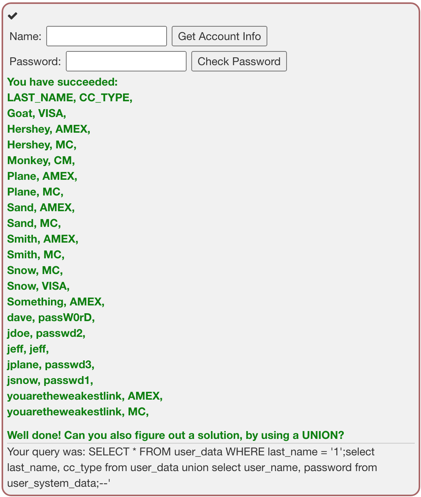
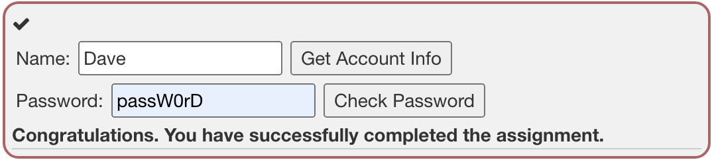

#  SQL Injection (advanced)

## Goals

- Combining SQL injection Techniques
- Blind SQL injection

## Special Characters

```
/* */			are inline comments
--, #			are line comments

Example: SELECT * FROM users WHERE name = 'admin' --AND pass = 'pass'
```

```
;					allows query chaining
```

```
', +, ||	allows string concatenation
Char()		strings without quotes

Example: SELECT * FROM users WHERE name = '+char(27) OR 1=1
```

세 번째꺼는 처음 본다!

------

## Special Statements

### Union

The Union operator is used, to combine the results of two or more SELECT Statements.

Rules to keep in mind, when working with a UNION:

- **The number of columns selected in each statement** must be the same.

- The datatype of the first column in the first SELECT statement, must match the datatype of the first column in the second(thirs, fourth, ...) SELECT Statement. The Same applies to all other columns.

  (컬럼위치가 같으면 데이터타입도 같아야한다.)

```sql
SELECT first_name FROM user_system_data UNION SELECT login_count FROM user_data;
```

The **UNION ALL** Syntax also allows duplicate Values.

### Joins

The Join operator is used to combine rows from two or more tables, based  on a related column.

두 개 이상의 테이블이나 데이터베이스를 연결하여 데이터를 검색하는 방법.

By using Primary key or Foreign key, you can connect two tables. To connect tables, there are at least one or more columns shared by the tables.

```sql
SELECT * FROM user_data INNER JOIN user_data_tan ON user_data.userid=user_data_tan.userid;
```

#### INNER JOIN

교집합이라고 생각하면 된다. 기준테이블과 Join한 테이블의 **중복된 값**을 보여준다.

결과값은 두 테이블이 모두 가지고 있는 데이터만 검색된다.

```sql
SELECT [테이블 별칭.조회할칼럼] FROM [기준테이블명 별칭] INNER JOIN [조인테이블명 별칭] ON [기준테이블명.기준키] = [조인테이블명.기준키]
```

```sql
--예제--
SELECT
A.NAME, --A테이블의 NAME조회
B.AGE --B테이블의 AGE조회
FROM EX_TABLE A
INNER JOIN JOIN_TABLE B ON A.NO_EMP = B.NO_EMP AND A.DEPT = B.DEPT
```

#### LEFT OUTER JOIN

기준테이블이 왼쪽이 되는 것이다.

```SQL
SELECT A.NAME, B.AGE --A테이블의 name, B테이블의 age 조회
FROM EX_TABLE A --기준테이블: EX_TABLE 별칭: A
LEFT OUTER JOIN JOIN_TABLE B ON A.NO_EMP = B.NO_EMP AND A.DEPT = B.DEPT
```

**기준테이블의 값 +** 조인테이블과 기준테이블의 **중복된 값**을 보여준다.

A를 기준으로 한다면 **A의 모든 데이터와 A와 B의 중복된 값**을 보여준다.

#### RIGHT OUTER JOIN

left outer join의 반대이다.

오른쪽테이블을 기준으로 join을 하겠다는 것이다.

#### FILL OUTER JOIN

쉽게 말해 **합집합**이다. A와 B가 가지고있는 모든 데이터가 검색되므로 사실상 기준테이블의 의미가 없다.

하. 힘들어 이외에도 많은 게 있다고 한다..

------

## Try It! Pulling data from other tables

The input field below is used to get data from a user by their last name.

The table is called 'user_data':

```sql
CREATE TABLE user_data (userid int not null,
                        first_name varchar(20),
                        last_name varchar(20),
                        cc_number varchar(30),
                        cc_type varchar(10),
                        cookie varchar(20),
                        login_count int);
```

너는 실험을 통해서 이 테이블이 sqli에 취약하다는 것을 알아냈다!

이제 너는 또다른 테이블의 내용을 얻기 위한 지식을 써보고싶다. 네가 데이터를 받아오길 원하는 테이블은:

```sql
CREATE TABLE user_system_data (userid int not null primary key,
			                   user_name varchar(12),
			                   password varchar(10),
			                   cookie varchar(30));
```

**a) Retrieve all data from the table**

```sql
1'; SELECT user_name, cc_type FROM user_data UNION SELECT user_name, password FROM user_system_data;--
```

내가 원하는 건 user_system_data의 데이터였고, UNION 을 써보면 좋을 것같은 문제였기 때문에 이렇게 넣었다.

결과는 밑에처럼 나왔다 ㅎㅎ



**b) When you have figured it out... What is Dave's password?**

내가 last_name과 password를 출력하게 했으니까 위 사진에서 dave를 찾으면 된다. dave의 비밀번호는 `passW0rD` 가 되겠다.ㅎㅎ



------

We now explained the basic steps involved in an SQL injection. In this assignment you will need to combine all things we explained in the SQL lessons.

Goal: **Can you login as Tom?**

Have fun!


저 응답을 보면, username_reg가 이미 있는지 없는지 조회하는 sql이 쓰이는 것을 알 수 있다. 그래서 우리는 저 뒤에 query chaining을 써서 우리가 원하는 Tom의 비밀번호를 알아낸다!