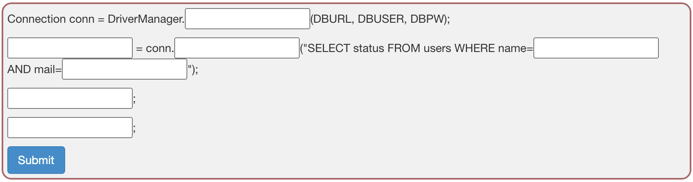
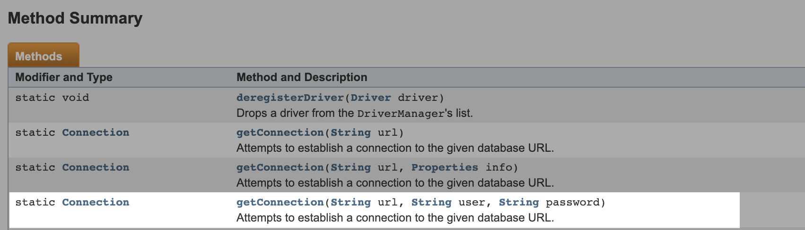
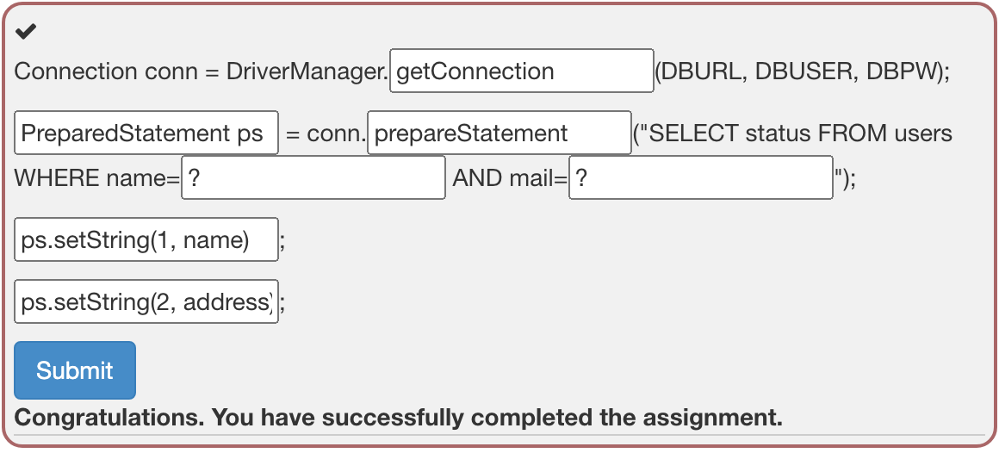
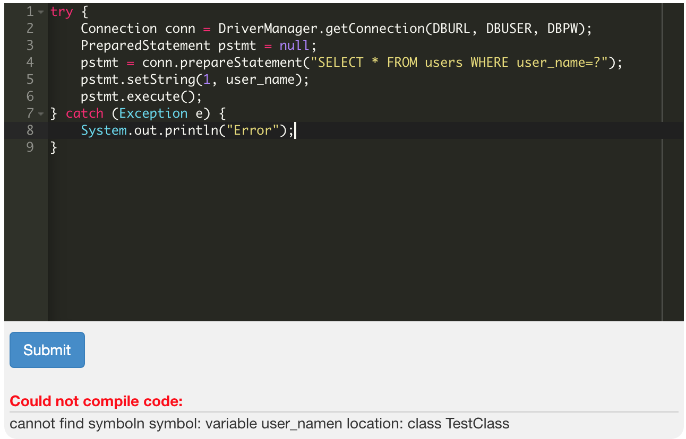
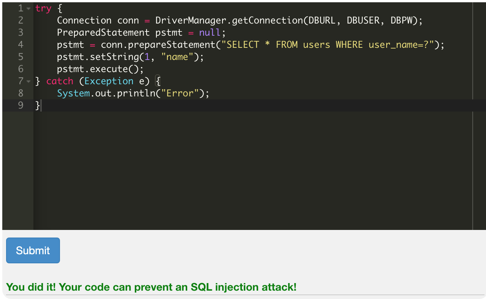

# SQL Injection (mitigation1)

## Immutable Queries

These are the best defense against SQL injection. They either do not have data that could get interpreted or they treat the data as a single entity that is bound to a column without interpretation.

: interperet될 수 있는 데이터를 가지고 있지 않거나 데이터를 interpretation 없이 column에 묶인 단일 요소로 취급한다. => SQLI 방어기법

### Static Queries

Static SQL 이란 String 형 변수에 담지 않고 코드 사이에 직접 기술한 SQL문을 말한다.

```sql
SELECT * FROM products;
```

```java
SELECT * FROM users WHERE user = "'" + session.getAttribute("UserID") + "'";
```

### Parameterized Queries

```java
String query = "SELECT * FROM users WHERE last_name = ?";
PreparedStatement statement = connection.prepareStatement(query);
statement.setString(1, accountName);
ResultSet results = statement.executeQuery();
```

### Stored Procedures

Stored procedure(저장 프로시저)

: DB를 다룰 때 사용하는 복잡한 쿼리문을 함수처럼 등록해두고 간단하게 사용할 수 있는 명령이다. 또한 매개변수도 반영할 수 있기 때문에 편리하다. 단, Only if stored procedure does not generate dynamic SQL

#### Safe Stored Procedure (Microsoft SQL Server)

: 저장 프로시저의 좋은 예인 것 같다. 

```sql
CREATE PROCEDURE ListCustomers(@Country nvarchar(30))
AS
	SELECT city, COUNT(*)
	FROM customers
	WHERE country LIKE @Country GROUP BY city

EXEC ListCustomers 'USA'
```

#### Injectable Stored Procedure (동일환경)

: 저장 프로시저의 안 좋은 예 (Dynamic SQL)

```sql
CREATE PROCEDURE getUser(@lastName nvarchar(25))
AS
	DECLARE @sql nvarchar(255)
	SET @sql = 'SELECT * FROM users WHERe lastname = + @LastName + '
EXEC sp_executesql @sql
```

어렵댜

------

### Parameterized Queries - Java Snippet

```java
public static bool isUsernamevalid(String username) {
  RegEx r = new Regex("^[A-Za-z0-9]{16}$");
  return r.isMath(username);
}

//java.sql.Connection conn 는 다른 곳에서 정의되어있을 것이다
PreparedStatement ps = null;
RecordSet rs = null;
try {
  pUserName = request.getParameter("UserName");
  if ( isUsernameValid (pUserName) ) {
    ps = conn.prepareStatement("SELECT * FROM user_table WHERE username = ? ");
    ps.setString(1, pUserName);
    rs = ps.execute();
    if( rs.next() ) {
      // do the work of making the user record active in some way
    }
  } else {} //handle invalid input 
} catch(..) {} //handle all exceptions...
```

우리 20들을 위한!! 해독!본^__^

```java
bool isUsernameValid(유저 이름) {
	//유효한지 아닌지 검사...
	return [유효한 이름인지 아닌지 true/false]
}
//conn은 이 코드의 다른 부분에서 정의가 되어있을 것이다. 
PreparedStatement 클래스를 ps라는 객체로 새로 만들겠다;
RecoredSet 클래스를 rs라는 객체로 새로 만들겠다;
try{ //오류가 나면 그 오류는 catch 에서 처리해라.
	pUserName은 이제 request에 포함된 Username이다.
	if(isUsernameValid(pUserName)){ //유저 이름이 유효하면(true)
		자 여기서, conn.prepareStatement(쿼리) 는 우리가 입력한 prepared statement를 저 연결 안에서 사용할 수 있게 (prepare)한다. 그리고 완성된 preparedStatement 객체를 반환한다. 우리가 만들어놓은 ps라는 빈 preparedStatement 변수에 그 객체를 대입한다.
		ps의 첫 번째 물음표에 pUserName을 넣는다.
    rs에 ps객체가 execute()를 실행하고(쿼리 수행이겠지) 반환한 값을 대입한다.
    if( rs.next() ) {
      //만약 rs.next()가 참을 반환하면 실행될 코드
    }
	} else{} //만약 유저 이름이 유효하지 않으면 실행
} catch(){} //저 try 블록 안에서 오류가 나면 여기에서 해결한다.
```

------

### Parameterized Queries - Java Example

: 파라미터화된 쿼리문이래요. 그럼 쿼리를 한번 볼까용?

```java
public static String loadAccount() {
	//Parser returns only valid string data
  String accountID = getParser().getStringParameter(AACT_ID, "");
  String data = null;
  String query = "SELECT first_name, last_name, acct_id, balance FROM user_data WHERE acct_id = ?";
  
  try (Connection connection = null; PreparedStatement statement = connection.prepareStatement(query)) {
    statement.setString(1, accountID);
    ResultSet results = statement.executeQuery();
    if (results != null && results.first()) {
      results.last(); // Only one record should be returned for this query
      if(results.getRoud() <= 2) {
        data = processAccount(results);
      } else {} //Handle the error - 데이터 무결성 issue
    } else {} //Handle the error - results라는 데이터가 없을 때
  } catch (SQLException sqle) {} // handle the sql 예외
  return data;
}
```

------

이제 문제를 풀어봅시다잉

### Try it! Writing safe code

You can see some code down below, but the code is incomplete. Complete the code, so that is no longer vulnerable for an SQL injection! Use the classes and methods you have learned before.

The code has to retrieve the status of the user based on the name and the mail address of the user. Both the name and the mail are in the string format.



사진을 보면 `conn`이라는 참조변수가 DriverManager 클래스의 (아마도) static 메서드가 반환하는 걸 받는 거 같다. Connection이니까 `getConnection()` 이지 않을까요 ㅎㅎ?

이렇게 넘어가면 좀 그러니까  문서를 찾아봤다... (귀찮아)



역시 `DriverManager` 클래스에 정의된 static 메서드였다.^__^

아무튼, 그래서 첫번째 빈칸에는 `getConnection`을 써주면 된다.

다음 코드는 많이 봤던 거다. 위에서 봤던 대로 Connection 객체의 `prepareStatement` 메소드에 매개변수로는 우리가 만들고 싶은 prepared statement를 placeholder(?) 를 사용해서 만들어주면 된다.

그리고 메서드가 반환하는 preparedStatement 객체를 가리킬 참조변수는 아무렇게나 내가 원하는 변수명을 지으면 된다. (보통 `pstmt` 를 많이 쓴다고 한다. 근데 난 보이게 캡쳐하기 위해 ps라고 지었다) 

그리고 나서는 ps의 placeholder를 `setString()` 메서드로 채워주면 된다.



첫번째 문제 끝!

------

### Try it! Writing safe code

Now it is time to write your own code! Your task is to use JDBC to connect to a database and requuest data from it.

**Reauirements**:

- connect to a database
- perform a query on the database which is immune to SQL injection attacks
- your query needs to contain at least one string parameter

이 문제 좀 이상하다. 파라미터를 하드코딩해야된다.



처음에는 pstmt를 setString()할 때 변수이름을 뭘로 해야되나 고민했는데 그냥 내맘대로니까 내맘대로 변수 설정도 해보고 request.getParameter()도 써봤는데 안됐다.



근데 하드코딩 방식으로 그냥 문자열을 넣어줬더니 맞았다.. 읭

------

