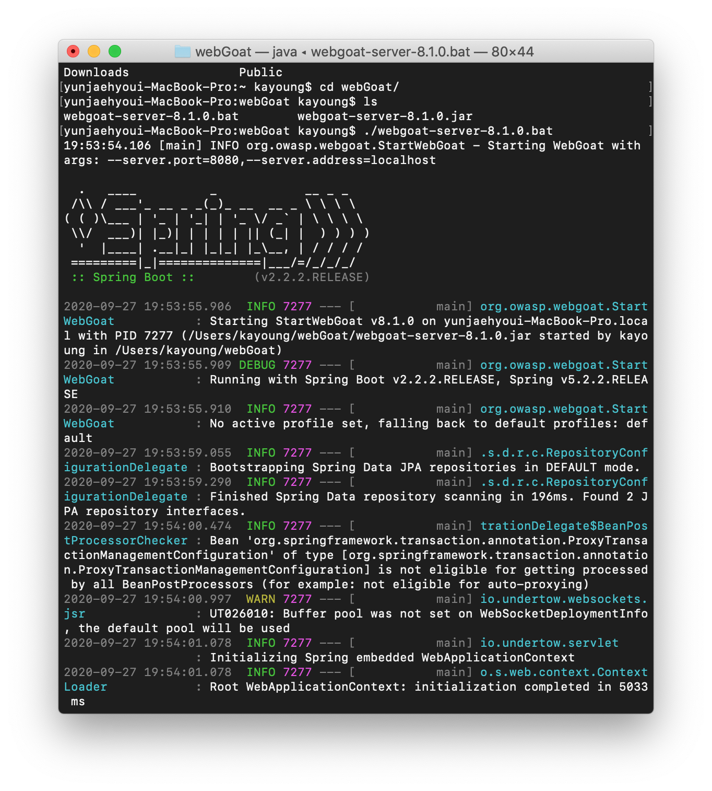
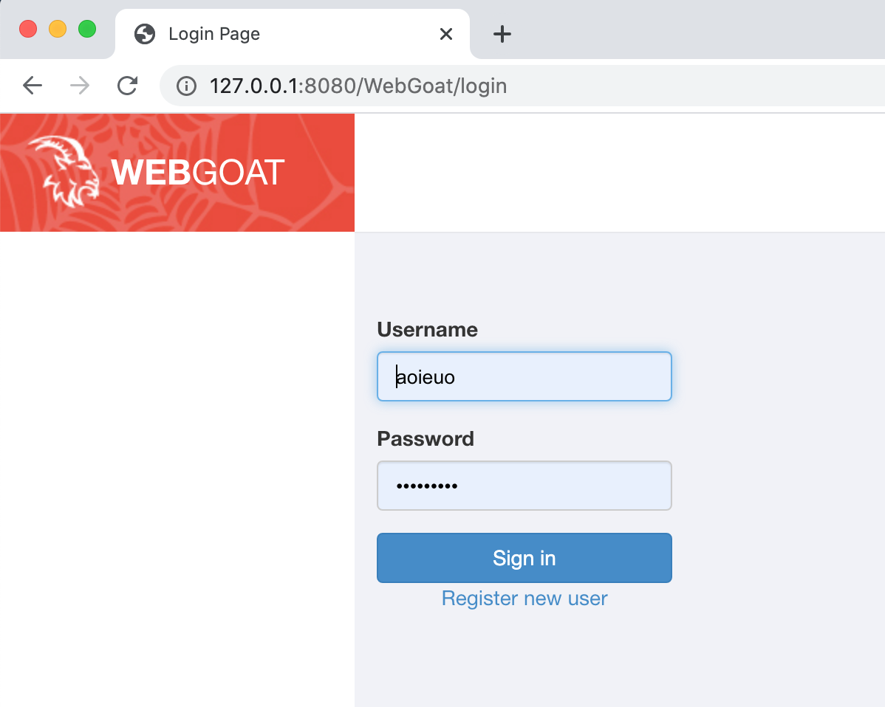

# WebGoat

<b>WebGoat</b>는 의도적으로 보안이 취약하게 만들어진 어플리케이션이다.

 Java 기반 애플리케이션에서 흔히 발견되는 취약점을 테스트할 수 있다.

### 설치 방법

1. <a href="https://github.com/WebGoat/WebGoat/releases">WebGoat Releases</a> 에 들어간당.

2. jar 파일을 다운 받는당.
3. 실행 IP, 포트번호를 입력, 실행! (포트번호는 그냥 8080 디폴트로 해도 되고 설정해도 된다. IP는 localhost라고 쓰면 된다.)

실행하면 이런 화면이 뜬다.

그리고 나서 브라우저에서

<a href="127.0.0.1:8080/WebGoat">127.0.0.1:8080/WebGoat</a> 로 접속하면 된당.ㅎㅎ

그러면 이렇게 뜬당.

끄 읏